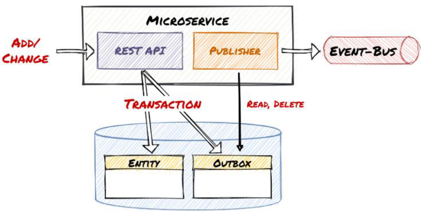

# Transactional Outbox

Die Transactional Outbox ist ein Architektur-Pattern, das häufig verwendet wird, um die Konsistenz zwischen einer
Datenbank und einer asynchronen Nachrichtenschlange oder einem Messaging-System sicherzustellen. Das Pattern wird
insbesondere in verteilten Systemen angewandt, in denen Datenbanken und Messaging-Systeme miteinander integriert werden
müssen.

## Problemstellung

In verteilten Systemen gibt es oft die Anforderung, dass Änderungen an einer Datenbank und das Versenden von
Nachrichten (z. B. über Kafka, RabbitMQ oder ähnliches) atomar erfolgen sollen. Ohne geeignete Maßnahmen kann es zu
Inkonsistenzen kommen, z. B. wenn eine Nachricht gesendet, aber nicht persistiert wird, oder umgekehrt.

## Lösung: Die Transactional Outbox

Das Transactional-Outbox-Pattern löst dieses Problem, indem es Änderungen an der Datenbank und das Hinzufügen von
Nachrichten zu einer Outbox-Tabelle innerhalb derselben Transaktion zusammenfasst. Die Nachrichten werden später von
einem separaten Prozess (oft ein Poller oder ein Event Streamer) aus der Outbox-Tabelle in das Messaging-System
übertragen.

### Schritte

1. **Persistieren in der Datenbank und Outbox**:
    - Bei der Bearbeitung eines Geschäftsprozesses wird die Datenbank aktualisiert und eine Nachricht in einer
      speziellen Outbox-Tabelle gespeichert. Dies geschieht innerhalb einer einzigen Transaktion.
2. **Commit der Transaktion**:
    - Erst nach erfolgreichem Abschluss der Transaktion (Commit) sind sowohl die Änderungen an der Datenbank als auch
      die Nachrichten in der Outbox-Tabelle garantiert vorhanden.
3. **Nachrichtentransport**:
    - Ein asynchroner Prozess (z. B. ein Polling-Service) liest die Outbox-Tabelle regelmäßig aus, versendet die
      Nachrichten an das Messaging-System und markiert sie anschließend als verarbeitet.
4. **Löschen der verarbeiteten Nachrichten**:

- Nach erfolgreichem Versand werden die Einträge in der Outbox-Tabelle gelöscht oder archiviert.

### Vorteile

- **Atomare Konsistenz**: Datenbankänderungen und Nachrichtenversand sind logisch gekoppelt, was die Konsistenz
  gewährleistet.
- **Fehlertoleranz**: Selbst bei Abstürzen können Nachrichten erneut aus der Outbox-Tabelle gelesen und verarbeitet
  werden.
- **Entkopplung**: Der Geschäftslogik-Code ist von der Logik zum Versand von Nachrichten getrennt.
- **Nachverfolgbarkeit**: Die Outbox-Tabelle dient als Audit-Log für gesendete Nachrichten.

### Herausforderungen

- **Outbox-Größe**: Die Outbox-Tabelle kann mit der Zeit groß werden und erfordert Strategien für das Löschen alter
  Einträge.
- **Latenz**: Es kann eine gewisse Verzögerung zwischen dem Commit der Transaktion und dem Versand der Nachricht geben.
- **Implementierung**: Die Implementierung eines zuverlässigen Polling-Prozesses oder eines Event-Streamers ist
  notwendig.

### Typische Einsatzszenarien

- **Microservices-Architektur**: Um sicherzustellen, dass Events oder Nachrichten konsistent zwischen Services
  verarbeitet werden.
- **Event-basierte Systeme**: Wo Datenbankänderungen in Echtzeit in ein Event-System wie Kafka veröffentlicht werden.
- **E-Commerce-Plattformen**: Um Transaktionen (z. B. Bestellungen) zuverlässig zu verarbeiten und gleichzeitig Events
  für andere Services zu generieren (z. B. für das Lager).

## Fazit

Die Transactional Outbox ist eine bewährte Methode, um in verteilten Systemen Konsistenz zu wahren und gleichzeitig die
Vorteile von Event-getriebener Kommunikation zu nutzen.